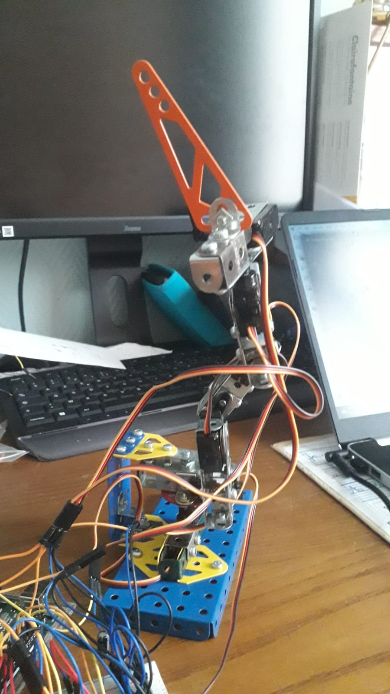

WORK IN PROGRESS

# LeMeccaBot

This repo present a homemade 5-edges arm with a gripper currently under development. The aim is to propose an robot arm cheaper and compatible with Hugging Face SO100 or S0101 for intiating to LeRobot framework. 
For cost reduction, 9g servos are used. Quite selfishly, supports are made with what I have: Meccano pieces.   

 
 