All photos are taken on millimetric (1mm) graph paper.

# Electronics

| Component  | Quantity |
| ------------- | ------------- |
| Arduino Uno R3  | 1  |
| USBA to USBB cable| 1| 
| MG90S 180° 9g servo  | 6  |
| 220µF capacitor  | 3  |
| breadbord | 1|
|jumper wires | a bunch of them |
| external power source + regulator + cable | 1 |

# Mechanical parts

## Meccano pieces
| Piece (nb of holes (if needed), Meccano ref)  | Quantity | Image |
| ------------- | ------------- |------------- |
| Double angle stirps (5 holes, 48a)  | 6  |
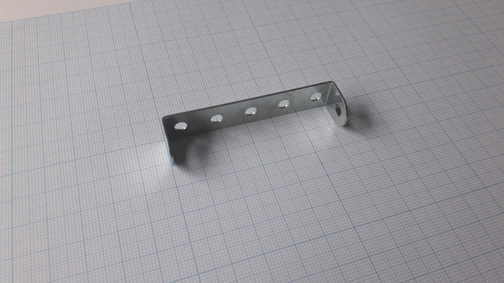 
 |
| Perforated strip (5 holes, 5)| 7 | 
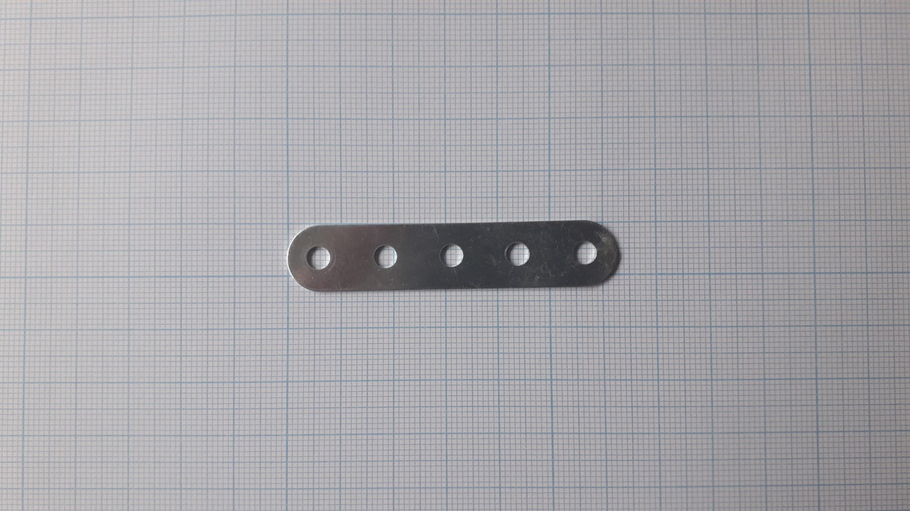 
 |
| Agnle bracket (12)  | 14  |
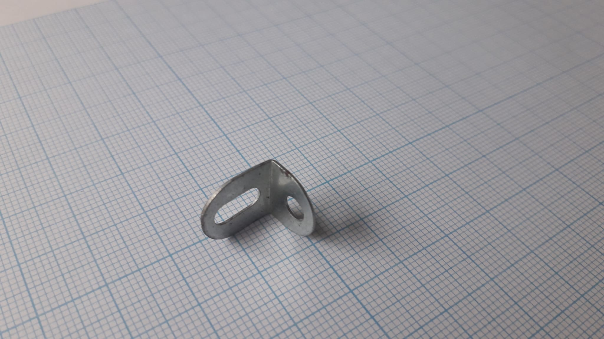 
 |
| Double bracket (11)  |  12 |
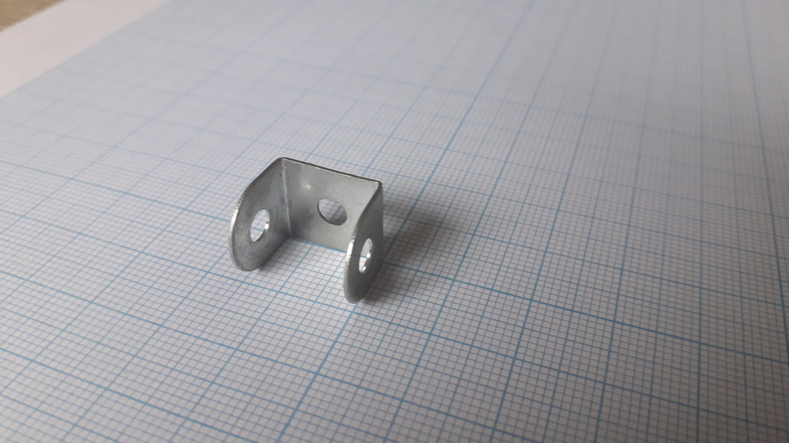 
|
| Fishplate (10)  |  ~18 |
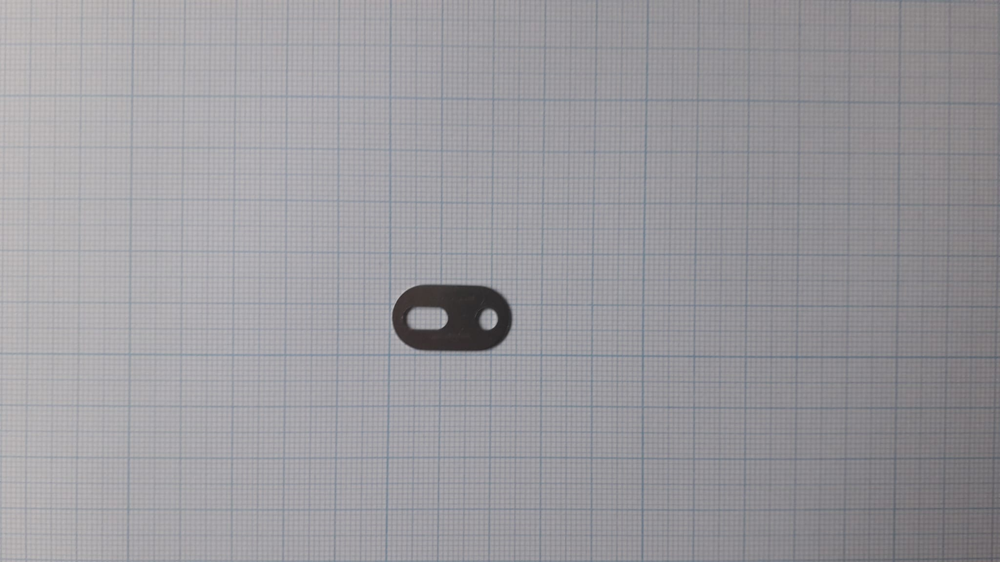 
 |
| Wheel Disc (8 holes, 24a)  |  1 |
 
|
| Flanged plate (3x5 holes, 51) | 1|
 
|
| Flanged plate (5x11 holes, 52) | 1|
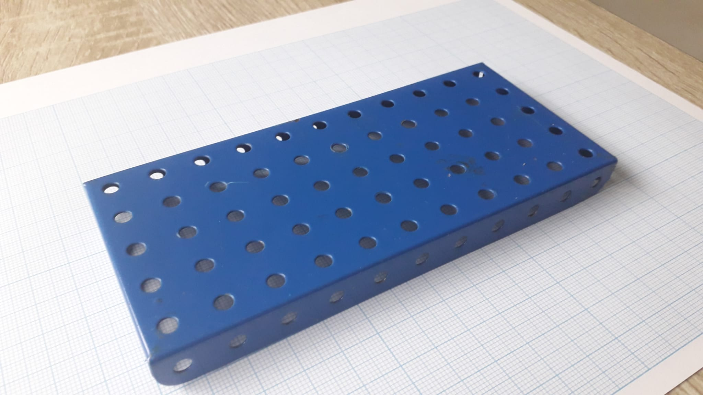 
|
|Reversed angle brackets(125) | 1 |
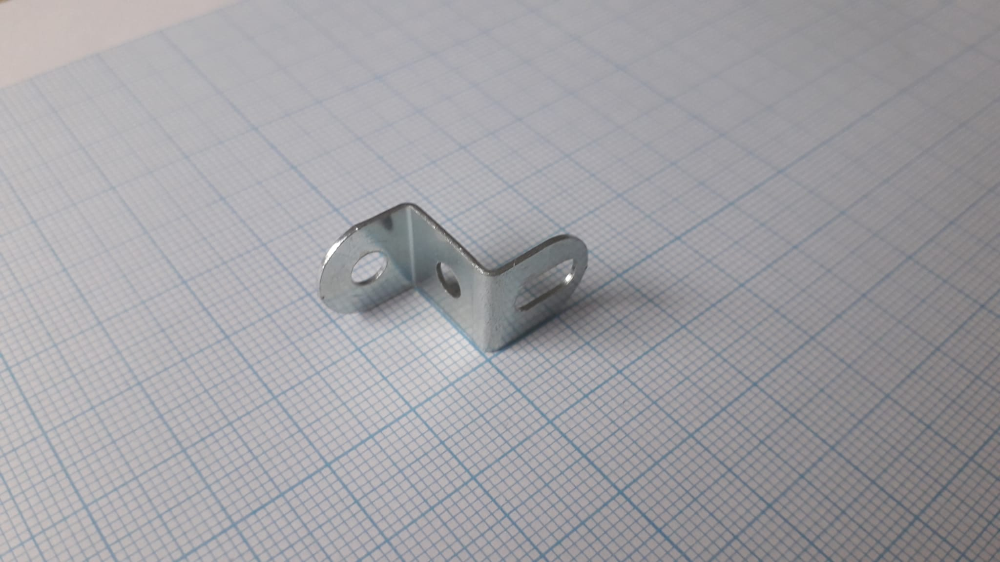 
|
| Trunnion (126) | 2 |
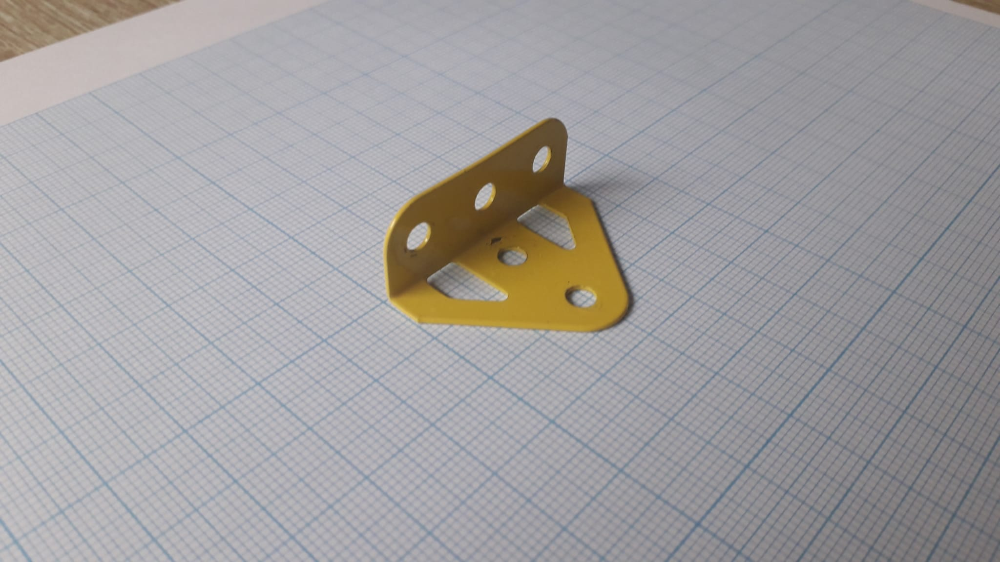 
 |
| Flat trunnion (125) | 2 |
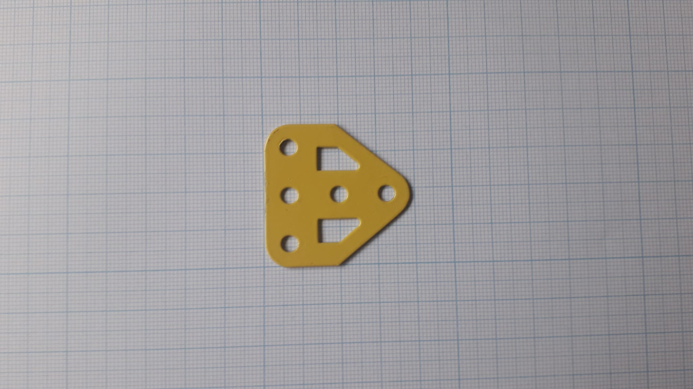 
 |
| Washer (10mm, 38) | 15 |
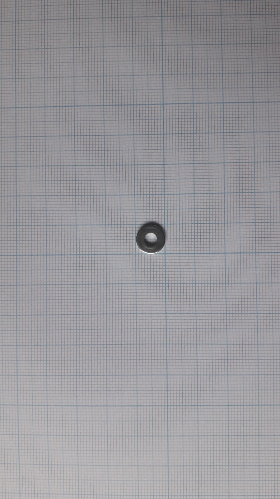 
 |
| Bolts (37b) | 44 |
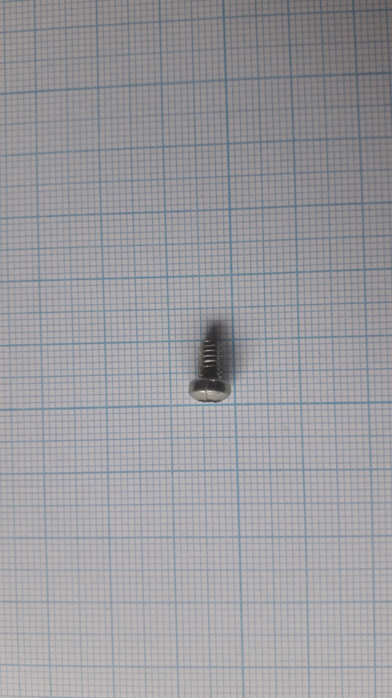 
 |
| Bolts (12mm, 111a) | 1 |
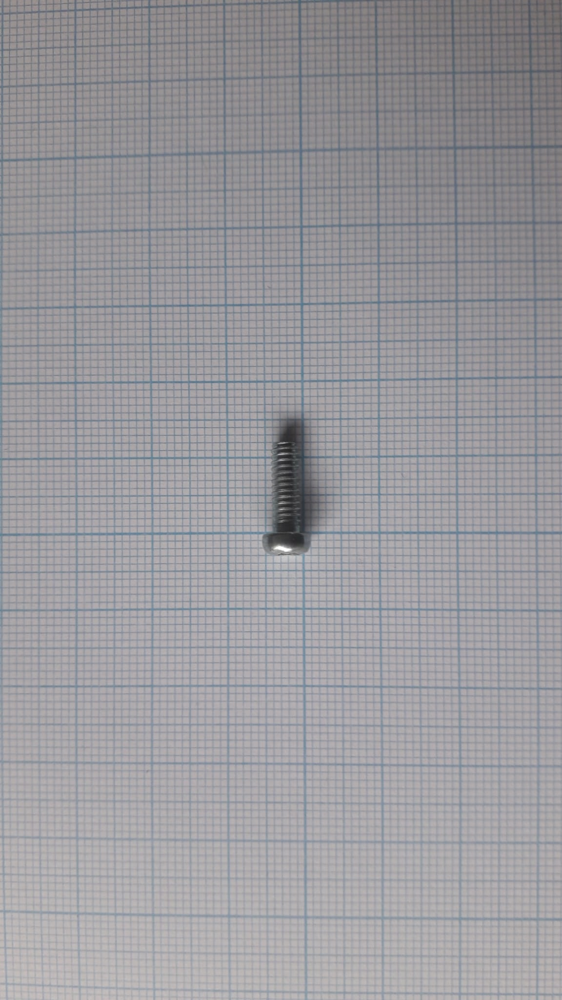 
|
| Nuts (37c) | 46 |
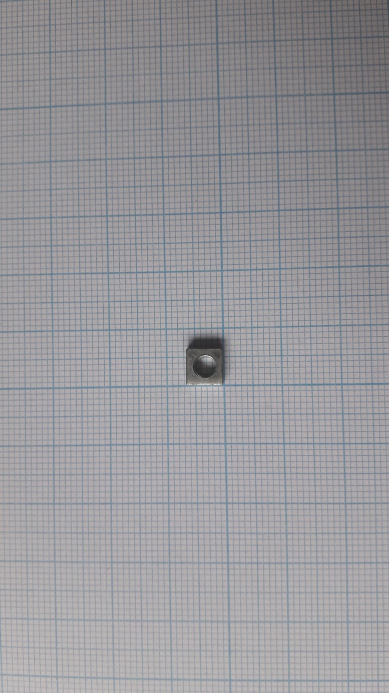 
|
| triangle (C472)\* | 2 |
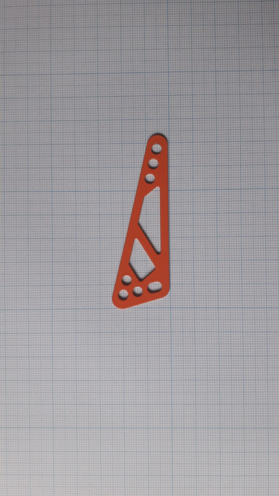 
 |

Meccano references are given according to [this catalogue](https://www.meccanospares.com/user/products/large/Illustrated%20Parts%20List%201971.pdf) except \* coming from a 2014 set. 

## Non Meccano pieces
| Piece   | Quantity | Image |
| ------------- | ------------- |------------- |
|M2 bolts (8mm length)|7|
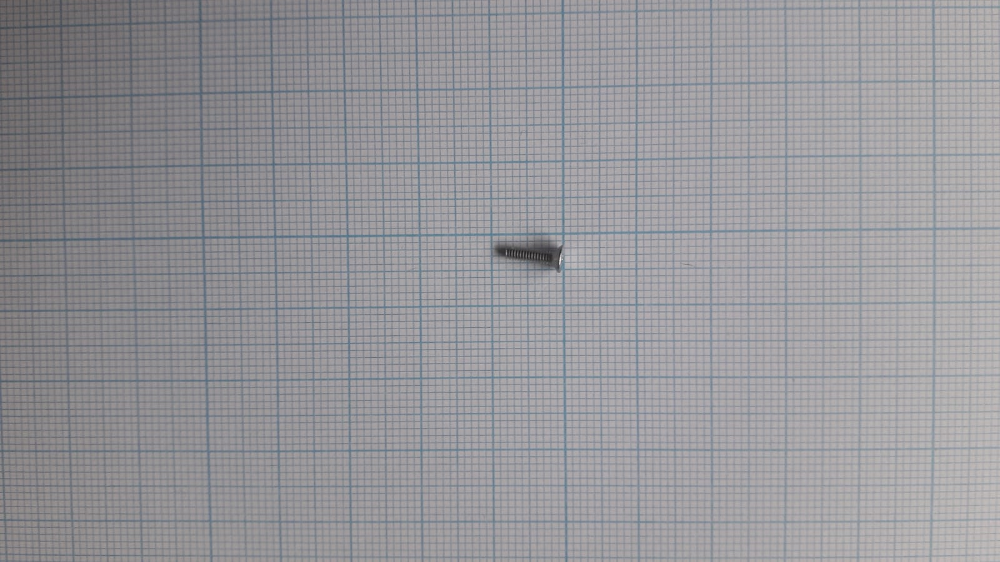 
|
|M2 nuts|7|
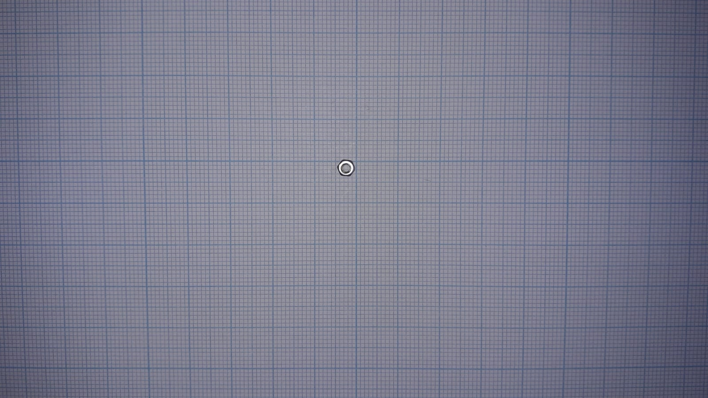 
|
|M2 Washer|8|
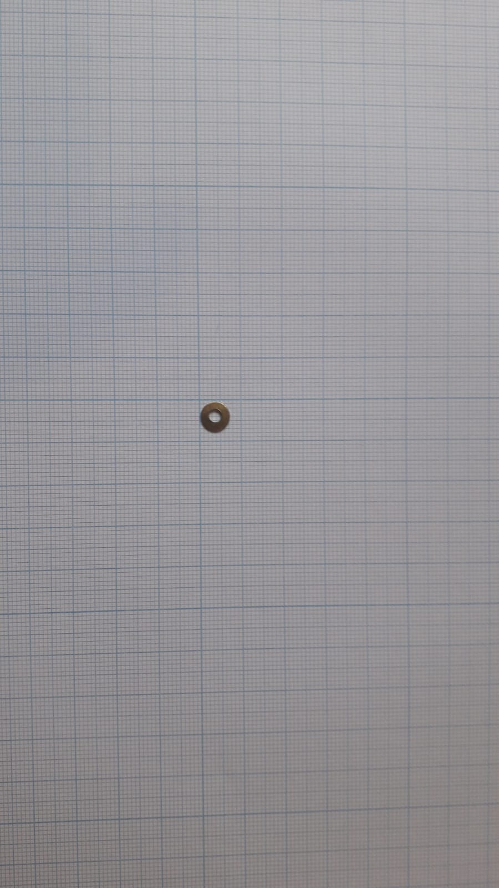 
|
|M2.5 bolts (8mm length)|6|
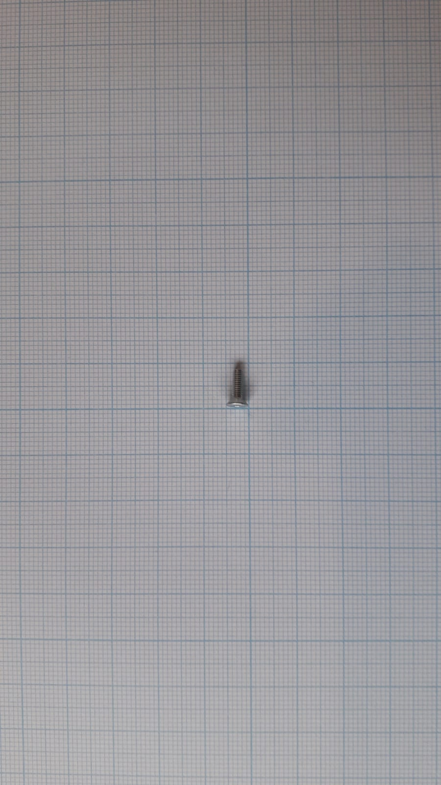 
|

